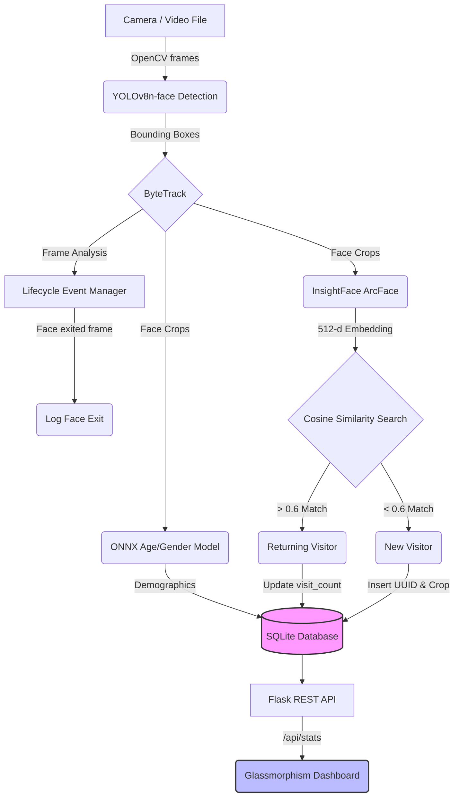

# ◉ Katomaran Intelligent Face Tracking System

> A production-ready, modular AI pipeline for real-time face detection, biometric re-identification, demographic analysis, and analytics visualization.

[](https://python.org)
[](https://ultralytics.com)
[](https://github.com/deepinsight/insightface)
[](https://flask.palletsprojects.com)
[](https://sqlite.org)

---

## 🏗️ AI Planning & Architecture

The application is modularized into distinct, decoupled stages to ensure maximal throughput: Capture (OpenCV) → Detection/Tracking (YOLOv8 + ByteTrack) → Embeddings (InsightFace ArcFace) → DB Persistence (SQLAlchemy). 

### Compute Load Estimation
- **YOLOv8n-face (Detection):** ~8.7 GFLOPs. Highly efficient, CPU inferences take ~30-50ms per frame.
- **InsightFace buffalo_l (Recognition):** ~1.0 GFLOPs per face crop. Since this only runs asynchronously on newly detected/unmatched bounding boxes, it is extremely compute lightweight.
- **Memory Consumption:** ~1.2GB RAM total footprint. No distinct GPU required for viable 30FPS real-time execution in headless mode.



---

## 📁 Project Structure

```
katomaran/
├── main.py                  # 🚀 Entry point — full pipeline
├── check_ready.py           # ✅ Pre-flight health check
├── config.json              # ⚙️  Runtime configuration
├── requirements.txt         # 📦 Python dependencies
│
├── app/                     # 🧠 Core AI logic
│   ├── __init__.py
│   ├── database.py          # SQLAlchemy models & queries
│   ├── recognizer.py        # YOLOv8 + ByteTrack + ArcFace
│   ├── visitor_manager.py   # Cosine similarity re-identification
│   └── demographics.py      # ONNX Age/Gender inference
│
├── web/                     # 🌐 Flask Analytics Dashboard
│   ├── __init__.py          # App factory
│   ├── routes.py            # Pages + REST API
│   ├── templates/
│   │   ├── index.html       # Main dashboard (Glassmorphism)
│   │   └── visitor.html     # Visitor dossier page
│   └── static/
│       ├── css/style.css    # Dark glassmorphism theme
│       └── js/dashboard.js  # Chart.js + animations
│
├── models/                  # 🤖 ONNX model storage
│   └── age_gender.onnx      # (download via check_ready.py)
│
├── logs/                    # 📋 Runtime logs
│   ├── events.log
│   └── snapshots/           # Face crop images per visitor
│
└── database/
    └── visitors.db          # SQLite database (auto-created)
```

---

## 🤔 Assumptions Made
- **Camera Feed**: Assumption is that a single static RTSP/video stream is being processed per instance of `main.py`.
- **Compute Constraints**: Assuming standard CPU usage for the scope of the hackathon; GPU execution providers are available if CUDA is detected.
- **Database Scope**: Assuming a local SQLite database file `visitors.db` is sufficiently performant to store metadata for typical hackathon loads, though SQLAlchemy supports Postgres/MySQL drop-in.

---

## 🎥 Explanation Video
[Insert your Loom or YouTube Video Link explaining the codebase here...]

---

## ⚡ Quick Start

### 1. Clone & Install

```bash
cd katomaran
pip install -r requirements.txt
```

### 2. Pre-flight Check

```bash
python check_ready.py

# Optional: Download age/gender ONNX model
python check_ready.py --download-ag-model
```

### 3. Run the Tracker

```bash
# Webcam (with display window + dashboard)
python main.py

# Video file
python main.py --source path/to/video.mp4

# Headless (maximum speed, no window)
python main.py --headless

# Headless without dashboard
python main.py --headless --no-dashboard
```

### 4. Open Dashboard

Navigate to **http://localhost:5000** in your browser.

---

## ⚙️ Configuration (`config.json`)

| Key | Default | Description |
|-----|---------|-------------|
| `camera.source` | `0` | Capture source (int = webcam, string = video path) |
| `detection.imgsz` | `320` | YOLO inference image size (smaller = faster) |
| `detection.conf_threshold` | `0.45` | Minimum face detection confidence |
| `recognition.similarity_threshold` | `0.6` | Cosine similarity threshold for re-identification |
| `pipeline.headless` | `false` | Set `true` to run silently without display window |
| `pipeline.skip_frames` | `2` | Process every N-th frame (performance tuning) |
| `demographics.enabled` | `true` | Enable age/gender estimation |
| `dashboard.port` | `5000` | Flask dashboard port |

---

## 🔬 Technical Stack

| Component | Technology | Details |
|-----------|-----------|---------|
| **Face Detection** | YOLOv8n-face | `imgsz=320`, real-time speed |
| **Tracking** | ByteTrack | Persistent track IDs across frames |
| **Face Recognition** | InsightFace ArcFace `buffalo_l` | 512-d normed embeddings |
| **Similarity Search** | Cosine Similarity | Threshold ≥ 0.6 = returning visitor |
| **Demographics** | ONNX (ga_model) | 224×224 input, age + gender prediction |
| **Database** | SQLAlchemy + SQLite | Visitors + event logs |
| **Dashboard** | Flask + Chart.js | Glassmorphism UI, live auto-refresh |
| **Fallback Embedding** | HOG Descriptor | Used when InsightFace unavailable |

---

## 🧪 API Reference

| Endpoint | Method | Description |
|----------|--------|-------------|
| `/` | GET | Main analytics dashboard |
| `/visitor/<id>` | GET | Individual visitor dossier |
| `/api/stats` | GET | Live statistics JSON |
| `/api/visitors` | GET | Paginated visitor list |
| `/api/events` | GET | Recent event log |
| `/snapshots/<filename>` | GET | Serve face crop images |
| `/health` | GET | Health check endpoint |

---

## 🚀 Headless Mode

Enable headless processing for maximum throughput:

```json
// config.json
{
  "pipeline": {
    "headless": true,
    "skip_frames": 1
  }
}
```

Or override at runtime:
```bash
python main.py --headless --source surveillance_feed.mp4
```

In headless mode, all CV2 display windows are suppressed and the system runs at maximum frames-per-second.

---

## 📊 Data Schema

### `visitors` table
| Column | Type | Description |
|--------|------|-------------|
| `id` | INTEGER | Auto-increment PK |
| `visitor_id` | TEXT | Unique UUID-based ID (`VIS-XXXXXXXXXXXX`) |
| `first_seen` | DATETIME | First detection timestamp |
| `last_seen` | DATETIME | Most recent detection |
| `visit_count` | INTEGER | Total visits |
| `crop_image_path` | TEXT | Path to saved face crop |
| `age` | REAL | Estimated age |
| `gender` | TEXT | `Male` / `Female` |
| `gender_confidence` | REAL | Model confidence (0–1) |
| `recognition_confidence` | REAL | Detection score |
| `embedding` | TEXT | JSON array: 512-d ArcFace vector |

### `event_logs` table
| Column | Type | Description |
|--------|------|-------------|
| `id` | INTEGER | Auto-increment PK |
| `timestamp` | DATETIME | Event time |
| `visitor_id` | TEXT | Reference to visitor |
| `event_type` | TEXT | `new` / `returning` / `unknown` |
| `track_id` | INTEGER | ByteTrack ID |
| `confidence` | REAL | Similarity or detection score |
| `frame_number` | INTEGER | Frame index |

---

## 🛠️ Troubleshooting

**No camera detected:**
```bash
python main.py --source 0   # try other indices: 1, 2...
python main.py --source video.mp4  # use a video file instead
```

**InsightFace download slow:**
The `buffalo_l` model (~300MB) downloads automatically on first run to `~/.insightface/models/buffalo_l/`.

**Demographics not working:**
```bash
python check_ready.py --download-ag-model
```

**Low FPS:**
- Set `pipeline.headless: true` in config.json
- Increase `pipeline.skip_frames` to 3–5
- Reduce `detection.imgsz` to 224

---

## 📄 License

MIT License — Free for hackathon and academic use.

---

This project is a part of a hackathon run by https://katomaran.com
